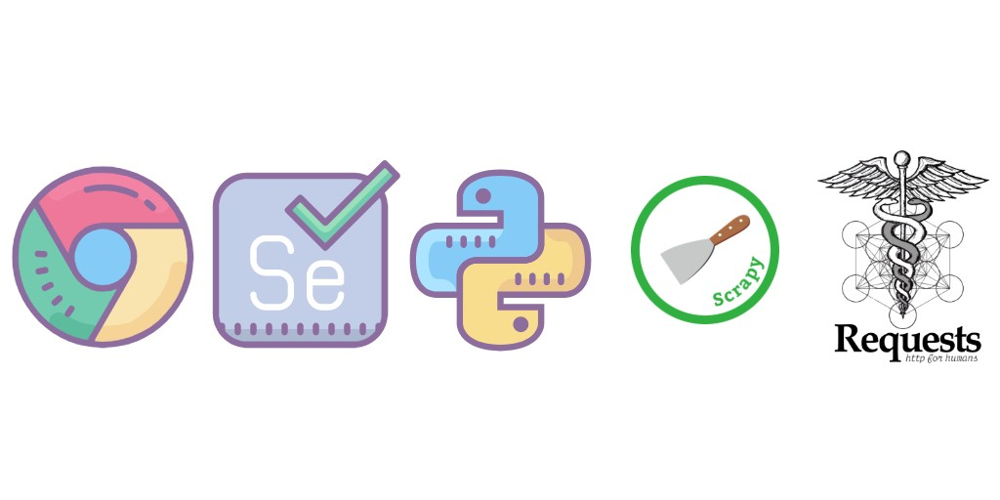

# Repository Overview
This repository uses Python to scrape business leads from a Yellow Pages, a website that contains over 27 million businesses in the United States. We use 'requests', a Python library to collect large amounts of unstructured data from Yellow Pages. Then, we use BeautifulSoup to parse relevant information from HTML format. After this process, we use Pandas to create dataframes and save those leads to .CSV files that can be used for marketing campaigns. 

